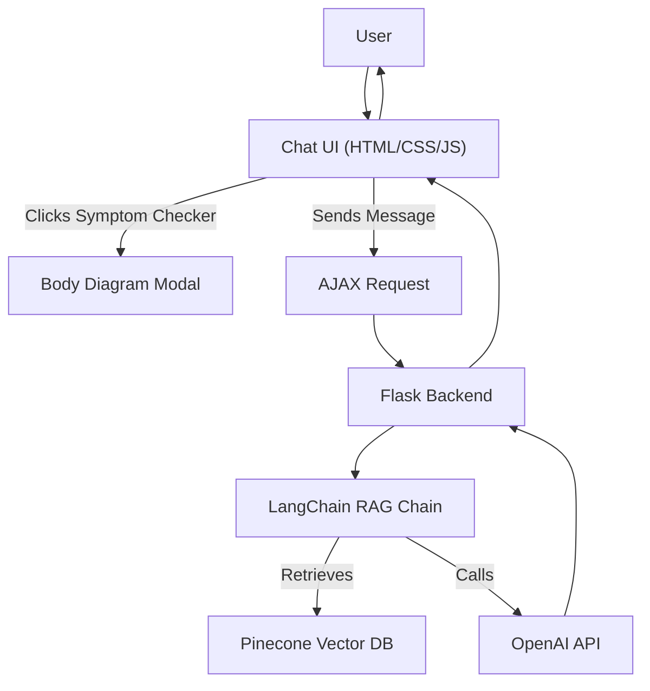
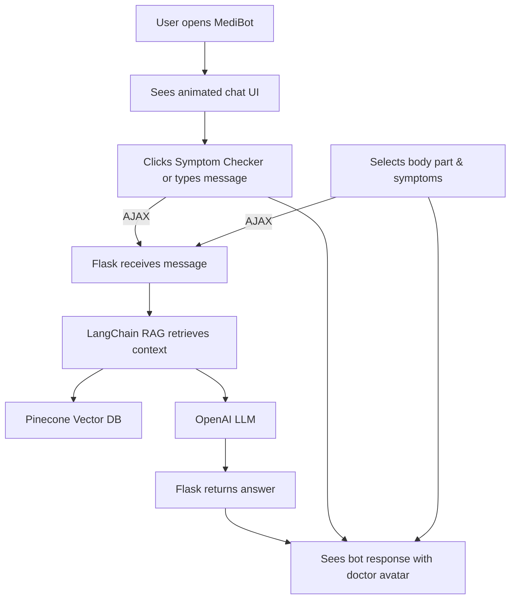

#  MediBot

A beautiful, interactive, and intelligent medical chatbot powered by LLMs, LangChain, and Pinecone. 

---

##  Overview

**MediBot** is your AI-powered medical assistant. It can:
- Chat naturally about health topics
- Check symptoms with an interactive body diagram
- Suggest possible causes and next steps
- Provide wellness tips and reminders
- Offer a delightful, animated chat experience

---

##  DEMO


---

## Architecture

### System Flow



### User Journey



---

##  Features

- **Animated, modern chat UI** (Bootstrap, custom CSS, SVG avatars)
- **Symptom Checker** with interactive body diagram
- **Contextual symptom selection** (body part → symptoms)
- **LLM-powered Q&A** (OpenAI, LangChain)
- **Retrieval-Augmented Generation** (RAG) with Pinecone
- **Customizable prompts and branding**
- **Mobile-friendly and accessible**

---

##  Quickstart

### 1. Clone & Set Up Environment

```bash
git clone https://github.com/OMaroua/MedicalChatbot.git
cd MedicalChatbot
conda create -n medibot python=3.10 -y
conda activate medibot
```

### 2. Install Dependencies

```bash
pip install -r requirements.txt
```

### 3. Set Up API Keys

- Create a `.env` file with your OpenAI and Pinecone API keys:
  ```env
  OPENAI_API_KEY=sk-...
  PINECONE_API_KEY=...
  ```

### 4. Index Your Medical Data

- Place your medical PDF(s) in the `Data/` folder.
- Run:
  ```bash
  python store_index.py
  ```

### 5. Run MediBot

```bash
python app.py
```
Visit [http://localhost:8080](http://localhost:8080) in your browser.

---

## Customization

### Change the Bot’s Personality
- Edit `src/prompt.py` and update `system_prompt` to change how MediBot responds.

### Change Branding & UI
- Edit `templates/chat.html` for logo, avatars, and layout.
- Edit `static/style.css` for colors, animations, and style.

### Add More Features
- Add new modules (e.g., medication tracker, appointment scheduler) in the UI and backend.
- Integrate with more APIs (Google Fit, news, etc.).

---

##  Project Structure

```
MedicalChatbot/
├── app.py                # Flask backend
├── src/                  # Helper, prompt, and logic
├── static/               # CSS and static assets
├── templates/            # HTML templates
├── Data/                 # Medical PDFs
├── store_index.py        # Indexing script
├── requirements.txt      # Python dependencies
└── README.md             # This file
```

---

##  Credits & License

- Built with [LangChain](https://langchain.com/), [OpenAI](https://openai.com/), [Pinecone](https://www.pinecone.io/), and [Bootstrap](https://getbootstrap.com/).
- MIT License. Feel free to use, modify, and share!

---

> _MediBot is not a substitute for professional medical advice. Always consult a healthcare provider for serious concerns._
